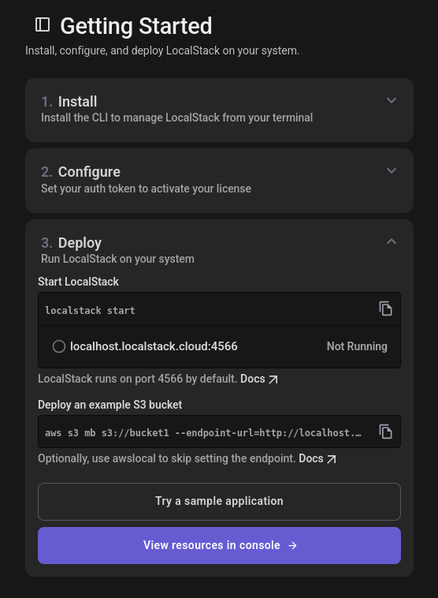

### Create your account

1. Go to [https://app.localstack.cloud/getting-started](https://app.localstack.cloud/getting-started).
2. Click **Sign Up** and create a **free account** (you can use GitHub, Google, or email).
3. After logging in, you’ll see a **dashboard** similar to this:

   

   *(This is the page where you’ll find installation and configuration instructions.)*

### Install the LocalStack CLI

Depending on your operating system, run the following commands in your terminal:

```bash
~ yay localstack
```

Once installed, verify everything is working correctly:

```bash
~ localstack --version
```

### Configure license token

After signing up, LocalStack gives you a personal auth token:

```bash
~ localstack auth set-token ls-XXXXXXXX-XXXX-XXXX-XXXX-XXXXXXXXXXXX
Token configured successfully
```

### Configure AWS credentials

LocalStack uses AWS-like credentials for compatibility with the AWS CLI and SDKs:

```bash
export AWS_ACCESS_KEY_ID="test"
export AWS_SECRET_ACCESS_KEY="test"
export AWS_DEFAULT_REGION="us-east-1"
```

---

```bash
~ localstack start

     __                     _______ __             __
    / /   ____  _________ _/ / ___// /_____ ______/ /__
   / /   / __ \/ ___/ __ `/ /\__ \/ __/ __ `/ ___/ //_/
  / /___/ /_/ / /__/ /_/ / /___/ / /_/ /_/ / /__/ ,<
 /_____/\____/\___/\__,_/_//____/\__/\__,_/\___/_/|_|

- LocalStack CLI: 4.10.0
- Profile: default
- App: https://app.localstack.cloud
```
